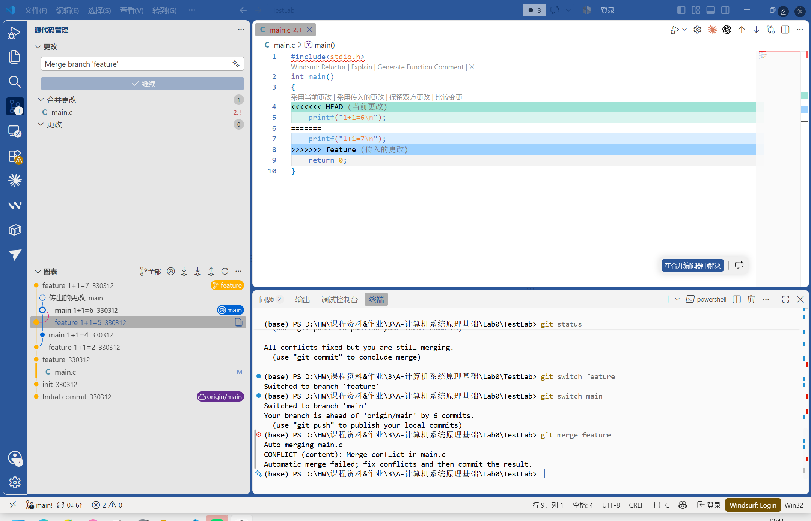
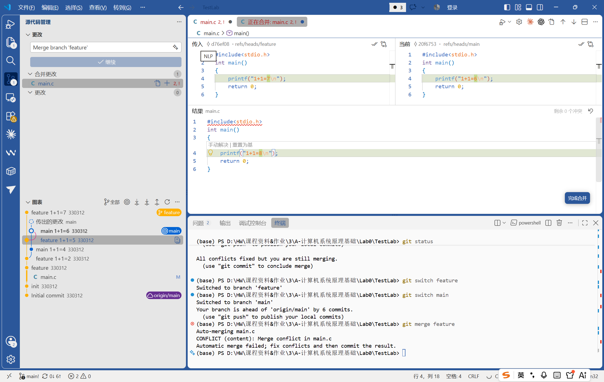

# Lab0：GitLab 实验报告

## 1. 文档问题

1. 你之前有过多人协同开发的经历吗？如果有，你们是使用什么方式分工协作的？
我之前有过用 GitHub 和别人一起写代码的经历，不过项目比较小，基本是每个人负责一部分，写完后再合到一起。

2. 思考一下，Git 为什么要设计“暂存-提交”两个步骤？
也许为了先选择这次想提交的修改？这样可以把无关或还没写完的内容留在工作区，不会一次全部提交上去。

3. git branch 和 git branch -a 的区别是什么？ 
`git branch` 只显示本地分支，`git branch -a` 会显示本地分支和远程跟踪分支，`-a` 是 `-all` 的意思。

## 2. 实验过程

### 2.1 建立仓库

已建立个人仓库：[330312/TestLab](https://github.com/330312/TestLab)，修改了 `main.c` 并进行了提交。

### 2.2 分支与冲突

我新建了 `feature` 分支，然后在 `feature` 和 `main` 分支中分别修改 `main.c` 里同一行的输出。切换到 `main` 后合并 `feature`，出现了冲突。

Git 在文件中标出了两边不同的内容。在 VSCode 的合并编辑器中查看两边的修改，并手动把结果改成了 `1+1=8`，然后将文件加入暂存区。

## 3. 参考资料阅读

### 3.1 Commit Message 规范

[Commit message 和 Change log 编写指南](https://www.ruanyifeng.com/blog/2016/01/commit_message_change_log.html)主要介绍了提交信息的写法。一个比较完整的提交信息可以包含 Header、Body 和 Footer，其中 Header 会说明修改类型、范围和主要内容。这样写能让提交记录更容易看懂，也方便之后查找修改。

### 3.2 Git Flow

[Gitflow 使用规范](https://www.dafaycoding.com/article/git-gif-flow)介绍了 `master`、`develop`、`feature`、`release` 和 `hotfix` 等分支的用途。不同类型的修改放在不同分支上，完成后再合并，可以让开发过程不那么混乱。

## 4. 为什么要学习 Git

我觉得 Git 最直接的作用是保存修改历史，写错后可以查看以前的版本。使用分支后，也可以先尝试新的修改，不影响原来的代码。多人合作时，Git 还能记录每个人的改动并帮助合并代码，所以写项目基本都会用到。
